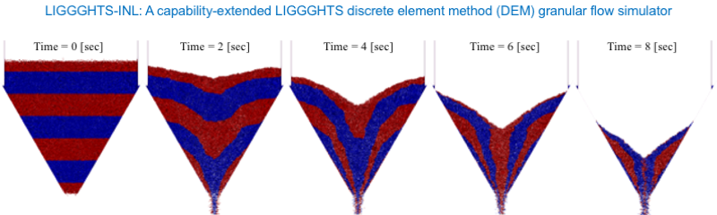
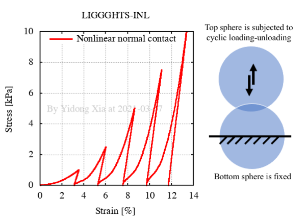
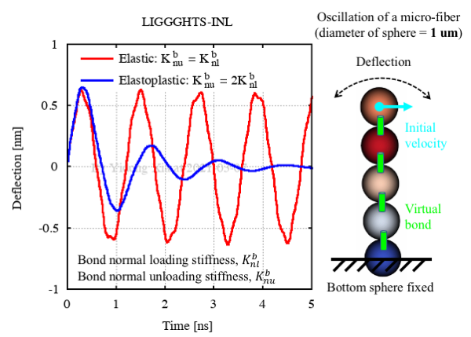
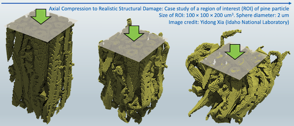

# LIGGGHTS-INL

**LIGGGHTS-INL** is a capability-extended adaptation of the LIGGGHTS Open Source Discrete Element Method (DEM) Particle Simulation Software based on LIGGGHTS release version 4.0.0. 

## Citing LIGGGHTS-INL

If you are using results generated with LIGGGHTS-INL, please cite the following articles:

* F. Chen, Y. Xia, J. Klinger, and Q. Chen, "A set of hysteretic nonlinear contact models for DEM: Theory, formulation, and application for lignocellulosic biomass." [*Powder Technology* 397 (2022): 117100.](https://doi.org/10.1016/j.powtec.2021.117100)
* Y. Xia, Z. Lai, T. Westover, J. Klinger, H. Huang, and Q. Chen. "Discrete element modeling of deformable pinewood chips in cyclic loading test." [*Powder Technology* 345 (2019): 1-14.](https://doi.org/10.1016/j.powtec.2018.12.072)
* Y. Guo, Q. Chen, Y. Xia, T. Westover, S. Eksioglu, and M. Roni. "Discrete element modeling of switchgrass particles under compression and rotational shear." [*Biomass & Bioenergy* 141 (2020): 105649.](https://doi.org/10.1016/j.biombioe.2020.105649)
* Y. Guo, Q. Chen, Y. Xia, J. Klinger, and V. Thompson. "A nonlinear elasto-plastic bond model for the discrete element modeling of woody biomass particles." [*Powder Technology* 385 (2021): 557-571.](https://doi.org/10.1016/j.powtec.2021.03.008)

## Auxiliary 3D Image Processing and Analysis Tools

- A set of MATLAB codes for 3D image-based porosity analysis: [tools/PorosityAnalysis3D](tools/PorosityAnalysis3D)
- A concise FIJI user tutorial for 3D image binarization: [tools/FIJI](tools/FIJI)

## LIGGGHTS-INL Documentation

Users are referred to the **LIGGGHTS-PUBLIC** documentation ([https://www.cfdem.com/media/DEM/docu/Manual.html](https://www.cfdem.com/media/DEM/docu/Manual.html)) for most of the common **LIGGGHTS** features. Documentation of some of the extended capabilities in **LIGGGHTS-INL** (e.g., the bonded-sphere model) can be found in this repository. Examples are provided below.

* Documentation of the bonded-sphere model:
`<repository>/doc/gran_cohesion_bond.html`
* User examples of the bonded-sphere model:
`<repository>/examples/LIGGGHTS/INL/cohesive_bond`

## Examples of Extended Capabilities in LIGGGHTS-INL

The following examples of nonlinear contact and bond stiffness models in LIGGGHTS-INL are extended from LIGGGHTS-PUBLIC. No user manual has yet been created for these extended models. Interested users are referred to the listed journal articles and/or user examples below for more information.

### Strain-hardening nonlinear normal contact

An example of controlled collision between two spherical particles can be found at:

`<repository>/examples/LIGGGHTS/INL/normal_contact_hysteretic_nonlinear1`

The simulation result is shown in the following plot:

### Elastoplastic bond normal stiffness

An example of macro-fiber made of five bonded spheres can be found at:

`<repository>/examples/LIGGGHTS/INL/elastoplastic_bond/chain_bending_mm_2`

The simulation result is shown in the following plot:

An example of microfiber made of five bonded spheres can be found at:

`<repository>/examples/LIGGGHTS/INL/elastoplastic_bond/chain_bending_um_2`

The simulation result is shown in the following plot:

### Micro-biomechanics

An example of compression test of a pine wood particle microstructural region of interest (ROI) can be found at:

`<repository>/examples/LIGGGHTS/INL/microstructure_compression`

The instantaneous snapshots of the simulation are shown in the following graph:

## Instructions for Code Compilation

We recommend Linux Ubuntu Long Term Service (LTS) releases. It might be the easiest platform, as all the prerequisites as well as the required configuration of the VTK library can be directly installed from Ubuntu's Software Center.

### Linux Ubuntu 22.04 LTS

Starting from this release, the installation requires more preparation steps, as the use of the default GCC and G++ (version 11) in this release would result in compilation errors. We recommend using GCC and G++ (version 9). Detailed command line instructions are provided below.

Installing GCC and G++ (version 9) compilers

* Install gcc-9: `sudo apt-get install gcc-9`
* Install g++-9: `sudo apt-get install g++-9`

Use the update-alternatives tool to create a list of multiple GCC and G++ compiler alternatives

* `sudo update-alternatives --install /usr/bin/gcc gcc /usr/bin/gcc-9 9`
* `sudo update-alternatives --install /usr/bin/g++ g++ /usr/bin/g++-9 9`
* `sudo update-alternatives --install /usr/bin/gcc gcc /usr/bin/gcc-11 11`
* `sudo update-alternatives --install /usr/bin/g++ g++ /usr/bin/g++-11 11`

Check the available C compilers list on your system and select desired version by entering relevant selection number.

* Enter the command: `sudo update-alternatives --config gcc`

>		There are 2 choices for the alternative gcc (providing /usr/bin/gcc).
>
>		Selection	Path			Priority	Status
>
>		------------------------------------------------------------
>
> 		  0		/usr/bin/gcc-11		11		auto mode
>
>		  1		/usr/bin/gcc-11		11		manual mode
>
>		* 2		/usr/bin/gcc-9		9		manual mode
>
>		Press <enter> to keep the current choice[*], or type selection number:

* In the example above, you should enter "2"

Check the available C++ compilers list on your system and select desired version by entering relevant selection number.

* Enter the command: `sudo update-alternatives --config g++`

>		There are 2 choices for the alternative g++ (providing /usr/bin/g++).
>
>		Selection	Path			Priority	Status
>
>		------------------------------------------------------------
>
> 		  0		/usr/bin/g++-11		11		auto mode
>
>		  1		/usr/bin/g++-11		11		manual mode
>
>		* 2		/usr/bin/g++-9		9		manual mode
>
>		Press <enter> to keep the current choice[*], or type selection number:

* In the example above, you should enter "2"

Check the version of the C compiler: `gcc --version`

> gcc (Ubuntu 9.4.0-5ubuntu1) 9.4.0
>
> Copyright (C) 2019 Free Software Foundation, Inc.
>
> This is free software; see the source for copying conditions.  There is NO
>
> warranty; not even for MERCHANTABILITY or FITNESS FOR A PARTICULAR PURPOSE.

Check the version of the C++ compiler: `g++ --version`

> g++ (Ubuntu 9.4.0-5ubuntu1) 9.4.0
>
> Copyright (C) 2019 Free Software Foundation, Inc.
>
> This is free software; see the source for copying conditions.  There is NO
>
> warranty; not even for MERCHANTABILITY or FITNESS FOR A PARTICULAR PURPOSE.

Install OpenMPI and VTK 7.1

* Install OpenMPI: `sudo apt-get install libopenmpi-dev openmpi-bin`
* Install VTK 7.1: `sudo apt-get install libvtk7-dev`

Compile the source code

* Navigate to `<repository>/src/`
* Compile the code with VTK: `make -j4 mpi_ubuntu-22.04`
* If compilation is successful, an executable will be generated: `lmp_mpi_ubuntu-22.04` 

### Linux Ubuntu 20.04 LTS

The command line instructions are below.

* Install OpenMPI: `sudo apt-get install libopenmpi-dev openmpi-bin`
* Install VTK 7.1: `sudo apt-get install libvtk7-dev`
* Navigate to `<repository>/src/`
* Compile the code with VTK: `make -j4 mpi_ubuntu-20.04`
* If compilation is successful, an executable will be generated: `lmp_mpi_ubuntu-20.04` 

### Other Linux distros

Compilation on other Linux distros (e.g., CentOS) is not too different from on Ubuntu. A major difference is that the VTK 7.1 library may need to be compiled and installed manually. Users can follow the instruction for macOS.

### macOS Catalina, Big Sur (Intel chip)

* **Important**: Open a Terminal window. Change the default **zsh** to **bash**: `chsh -s /bin/bash`
* Use Homebrew to install OpenMPI. 
* Install VTK 7.1 manually. **Attention**: Do not use Homebrew to install VTK. VTK libraries from Homebrew were pre-built without some required options on (i.e., **MPI**). Without **MPI** on, some required libraries will be missing (vtkIOParallel, vtkIOParallel, vtkParallelCore, vtkParallelMPI, vtkIOParallelXML, etc.). We use `/opt/vtk` as an example of instalation directory to provide a detailed instruction of compiling the VTK 7.1 compilation. Additional prerequisite libraries may be needed on your system and can be installed from Homebrew.
	* Create a folder: `sudo mkdir /opt/vtk`
	* Download [https://www.vtk.org/files/release/7.1/VTK-7.1.1.zip](https://www.vtk.org/files/release/7.1/VTK-7.1.1.zip) to the `Downloads` directory.
	* Unzip the zip file so you will see a folder `~/Downloads/VTK-7.1.1`.
	* Create a new folder: `mkdir ~/Downloads/VTK-build`.
	* Navigate to the new folder: `cd ~/Downloads/VTK-build`.
	* Do: `ccmake ../VTK-7.1.1`. (If your system does not recognize the **ccmake** command, use Homebrew to install the **cmake** package.) You should see an interface like the screenshot below. 
	* Press [c] to **Configure**. If the configuration process completes without issue, you will see something similar to the snapshot below. If you encounter issues, which are usually warning messages of missing libraries, use Homebrew to install the missing libraries as indicated.  
	* Press [e] to exit screen. You will see something similar to the screenshot below.   There are three options that we need to modify in the listed options. (1) Change the **CMAKE BUILD TYPE** value from **Debug** to **Release**. 2) Change the **CMAKE INSTALL PREFIX** value from whatever in there to **/opt/vtk**. (3) Change the **VTK Group MPI** value from **OFF** to **ON**. Then the screen should look similar to the screenshot below. 
	* Press [c] to **Configure** a 2nd time. If the configuration completes without issue, you should see **Configuring done** in the last line of screen output. Press [e] to exit screen.
	* Press [c] to **Configure** a 3rd time. If the configuration completes without issue, you should see **Configuring done** in the last line of screen output. Press [e] to exit screen.
	* Now you should see an extra key option **[g] Generate**. Press [g]. This will complete the whole configuration process and you will be out of CMake interface upon completion.
	* Compile VTK with one CPU core: `make`, or multiple cores, e.g., `make -j4`. Upon completion, you should see something similar to the screenshot below. 
	* Install VTK to the designated installation directory: `sudo make install`.
	* Add the location of VTK libraries to the system environment variable: `vi ~/.bash_profile` and add a line `export DYLD_LIBRARY_PATH=/opt/vtk/lib` in the file. Save and quit.
* Open a new Terminal window and navigate to `<repository>/src/`
* Compile the code with VTK: `make -j4 mpi_vtk-7.1`. 

## Other Software
Idaho National Laboratory is a cutting edge research facility which is a constantly producing high quality research and software. Feel free to take a look at our other software and scientific offerings at:

[Primary Technology Offerings Page](https://www.inl.gov/inl-initiatives/technology-deployment)

[Supported Open Source Software](https://github.com/idaholab)

[Raw Experiment Open Source Software](https://github.com/IdahoLabResearch)

[Unsupported Open Source Software](https://github.com/IdahoLabCuttingBoard)

## License

Copyright 2020 Battelle Energy Alliance, LLC

Licensed under the GPL v2 (the "License");
you may not use this file except in compliance with the License.
You may obtain a copy of the License at

 https://opensource.org/licenses/GPL-2.0

Unless required by applicable law or agreed to in writing, software
distributed under the License is distributed on an "AS IS" BASIS,
WITHOUT WARRANTIES OR CONDITIONS OF ANY KIND, either express or implied.
See the License for the specific language governing permissions and
limitations under the License.

Licensing
-----
This software is licensed under the terms you may find in the file named "LICENSE" in this directory.

Developers
-----
By contributing to this software project, you are agreeing to the following terms and conditions for your contributions:

You agree your contributions are submitted under the GPL v2 license. You represent you are authorized to make the contributions and grant the license. If your employer has rights to intellectual property that includes your contributions, you represent that you have received permission to make contributions and grant the required license on behalf of that employer.

# Content below is from LIGGGHTS
----------------------------------------------------------------------
This is the

██╗     ██╗ ██████╗  ██████╗  ██████╗ ██╗  ██╗████████╗███████╗
██║     ██║██╔════╝ ██╔════╝ ██╔════╝ ██║  ██║╚══██╔══╝██╔════╝
██║     ██║██║  ███╗██║  ███╗██║  ███╗███████║   ██║   ███████╗
██║     ██║██║   ██║██║   ██║██║   ██║██╔══██║   ██║   ╚════██║
███████╗██║╚██████╔╝╚██████╔╝╚██████╔╝██║  ██║   ██║   ███████║
╚══════╝╚═╝ ╚═════╝  ╚═════╝  ╚═════╝ ╚═╝  ╚═╝   ╚═╝   ╚══════╝®

DEM simulation engine, released by 
DCS Computing GmbH, Linz, Austria
www.dcs-computing.com, office@dcs-computing.com

LIGGGHTS® is open-source, distributed under the terms of the GNU Public 
License, version 2 or later.

LIGGGHTS® is part of CFDEM®project: 
www.liggghts.com | www.cfdem.com

Core developer and main author:
Christoph Kloss, christoph.kloss@dcs-computing.com

LIGGGHTS® and CFDEM® are registered trade marks of DCS Computing GmbH, 
the producer of the LIGGGHTS® software and the CFDEM®coupling software
See http://www.cfdem.com/terms-trademark-policy for details.

----------------------------------------------------------------------
Copyright 2012-     DCS Computing GmbH, Linz
Copyright 2009-2015 JKU Linz
Some parts of LIGGGHTS® are based on LAMMPS and Copyright on these
parts is held by Sandia Corporation and other parties. Info on LAMMPS below
Some parts of LIGGGHTS® are contributied by other parties, which are
holding the Copyright. This is listed in each file of the distribution.
----------------------------------------------------------------------

The LIGGGHTS® distribution includes the following files and directories:

README          this file
LICENSE         the GNU General Public License (GPL)
doc             documentation
examples        simple example simulation setups
lib             libraries LIGGGHTS® can be linked with
python          Python wrapper on LIGGGHTS® as a library
src             source files

Point your browser at any of these files to get started:

doc/Manual.html	           the manual
doc/Section_intro.html	   hi-level introductio
doc/Section_start.html	   how to build and use

----------------------------------------------------------------------

Some parts of LIGGGHTS® are based on LAMMPS
LAMMPS stands for Large-scale Atomic/Molecular Massively Parallel
Simulator. 

LAMMPS is Copyright (2003) Sandia Corporation.  Under the terms of Contract
DE-AC04-94AL85000 with Sandia Corporation, the U.S. Government retains
certain rights in this software.  This software is distributed under
the GNU General Public License.

LAMMPS is a classical molecular dynamics simulation code designed to
run efficiently on parallel computers.  It was developed at Sandia
National Laboratories, a US Department of Energy facility, with
funding from the DOE.  It is an open-source code, distributed freely
under the terms of the GNU Public License (GPL).

The primary author of LAMMPS is Steve Plimpton, who can be emailed
at sjplimp@sandia.gov.  The LAMMPS WWW Site at lammps.sandia.gov has
more information about the code and its uses.

----------------------------------------------------------------------

Core developer and main author of LIGGGHTS®:
Christoph Kloss, christoph.kloss@dcs-computing.com
