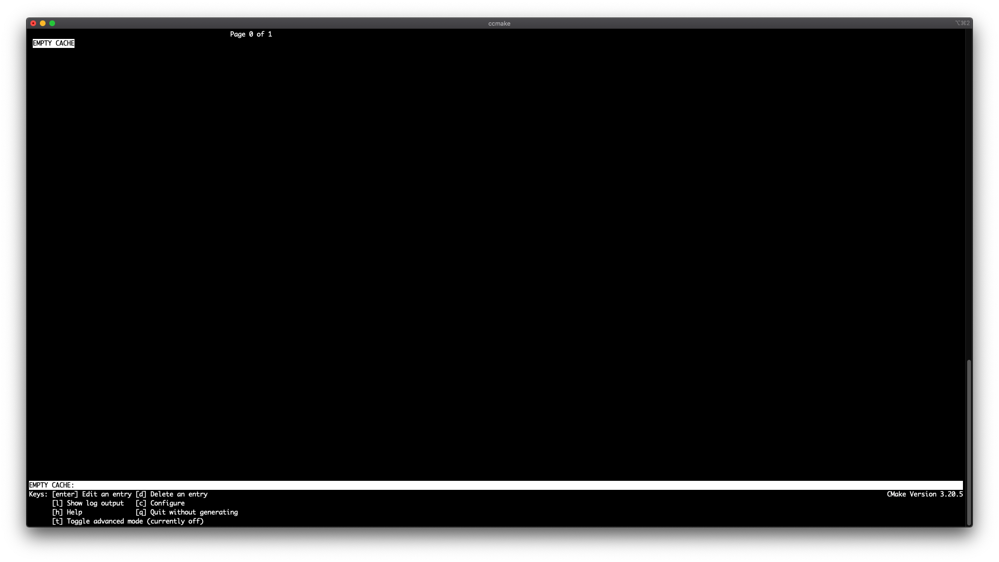
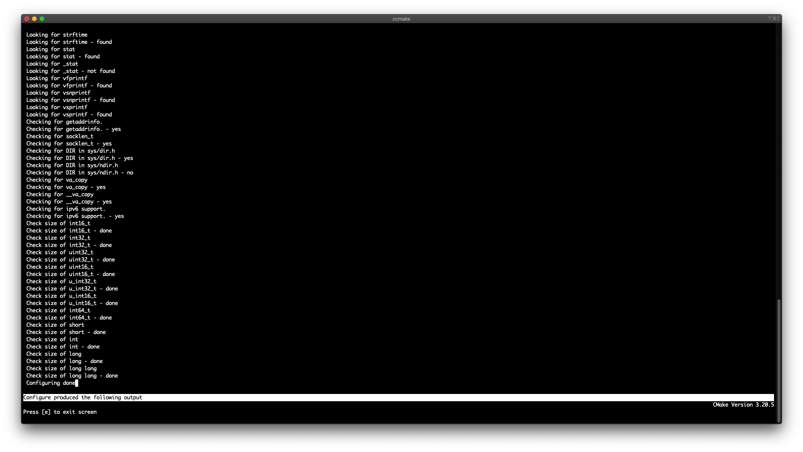
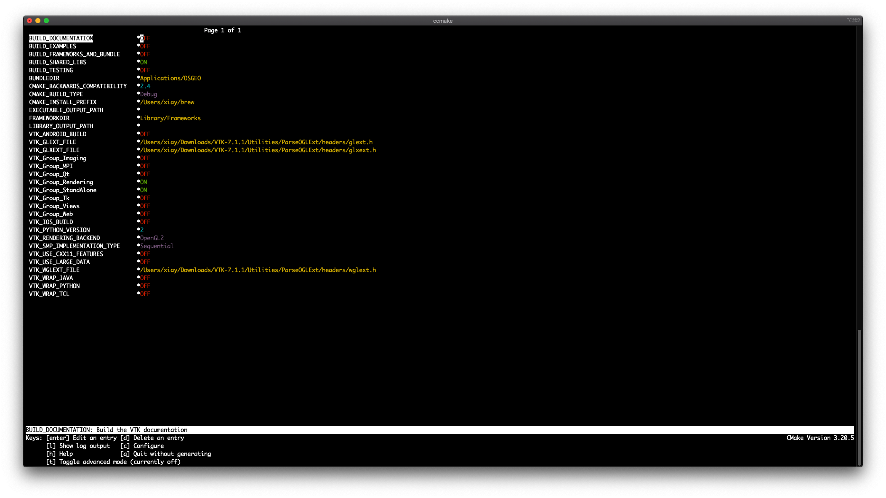
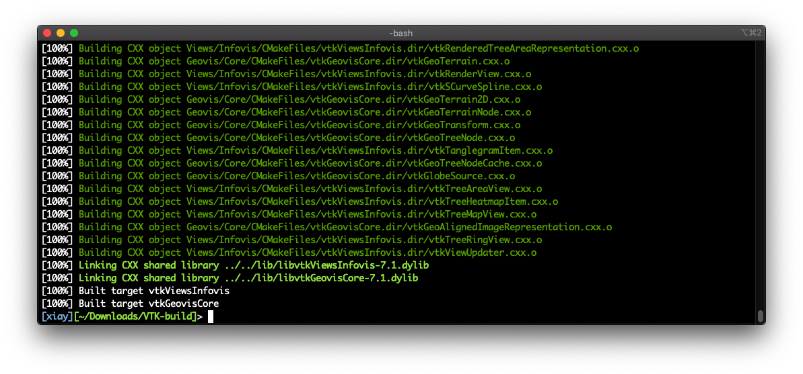

# Installing LIGGGHTS-INL

Detailed instructions for installing LIGGGHTS-INL on the latest Linux Ubuntu LTS and macOS releases are provided as follows.

## Linux Ubuntu

Tested releases:

* **Linux Ubuntu 22.04 LTS**
* **Linux Ubuntu 20.04 LTS**

<!-- Starting from this release, the installation requires more preparation steps, as the use of the default GCC and G++ (version 11) in this release would result in compilation errors. We recommend using GCC and G++ (version 9). Detailed command line instructions are provided below.-->

<!-- **Install GCC and G++ (version 9) compilers and make the default version as 9** -->

<!-- * Install gcc-9: `sudo apt-get install gcc-9` -->
<!-- * Install g++-9: `sudo apt-get install g++-9` -->

<!-- Use the update-alternatives tool to create a list of multiple GCC and G++ compiler alternatives -->

<!-- * `sudo update-alternatives --install /usr/bin/gcc gcc /usr/bin/gcc-9 9` -->
<!-- * `sudo update-alternatives --install /usr/bin/g++ g++ /usr/bin/g++-9 9` -->
<!-- * `sudo update-alternatives --install /usr/bin/gcc gcc /usr/bin/gcc-11 11` -->
<!-- * `sudo update-alternatives --install /usr/bin/g++ g++ /usr/bin/g++-11 11` -->

<!-- Check the available C compilers list and select desired version by entering relevant selection number. -->

<!-- * Enter the command: `sudo update-alternatives --config gcc` -->

<!-- >		There are 2 choices for the alternative gcc (providing /usr/bin/gcc). -->
<!-- > -->
<!--  >		Selection	Path			Priority	Status -->
<!-- > -->
<!-- > -->	
<!-- ------------------------------------------------------------ -->
<!-- > -->
<!-- > 		  0		/usr/bin/gcc-11		11		auto mode -->
<!-- > -->
<!-- >		  1		/usr/bin/gcc-11		11		manual mode -->
<!-- > -->
<!-- >		* 2		/usr/bin/gcc-9		9		manual mode -->
<!-- > -->
<!-- >		Press <enter> to keep the current choice[*], or type selection number: -->

<!-- * In the example above, you should enter "2" -->

<!-- Check the version of the C compiler: `gcc --version`. We only show the first line of the output. -->

<!-- > gcc (Ubuntu 9.4.0-5ubuntu1) 9.4.0 -->

<!-- Check the available C++ compilers list and select desired version by entering relevant selection number. -->

<!-- * Enter the command: `sudo update-alternatives --config g++` -->

<!-- >		There are 2 choices for the alternative g++ (providing /usr/bin/g++). -->
<!-- > -->
<!-- >		Selection	Path			Priority	Status -->
<!-- > -->
<!-- > ------------------------------------------------------------ -->
<!-- > -->
<!-- > 		  0		/usr/bin/g++-11		11		auto mode -->
<!-- > -->
<!-- >		  1		/usr/bin/g++-11		11		manual mode -->
<!-- > -->
<!-- >		* 2		/usr/bin/g++-9		9		manual mode -->
<!-- > -->
<!-- >		Press <enter> to keep the current choice[*], or type selection number: -->

<!-- * In the example above, you should enter "2" -->

<!-- Check the version of the C++ compiler: `g++ --version`. We only show the first line of the output. -->

<!-- > g++ (Ubuntu 9.4.0-5ubuntu1) 9.4.0 -->

Follow the Terminal command line instructions below.

**Install the prerequisites**:

* Install wget: `sudo apt-get wget`
* Install git: `sudo apt-get install git`
* Install OpenMPI: `sudo apt-get install libopenmpi-dev openmpi-bin`
* Install VTK 7.1: `sudo apt-get install libvtk7-dev`

**Download the LIGGGHTS-INL repository**:

* Option 1a. For users: `git clone https://github.com/idaholab/LIGGGHTS-INL.git`
* Option 1b. For users: `wget https://github.com/idaholab/LIGGGHTS-INL/archive/refs/heads/inl.zip`
* Option 2. For developers: `git clone git@github.com:idaholab/LIGGGHTS-INL.git`

**Compiling the source code**

* Navigate to the repository folder `LIGGGHTS-INL/src/`
* If you have Ubuntu 22.04 LTS, compile the code with VTK: `make -j4 mpi_ubuntu-22.04`. If compilation is successful, an executable file named `lmp_mpi_ubuntu-22.04` will be generated in `LIGGGHTS-INL/src`.
* If you have Ubuntu 20.04 LTS, compile the code with VTK: `make -j4 mpi_ubuntu-20.04`. If compilation is successful, an executable file named `lmp_mpi_ubuntu-20.04` will be generated in `LIGGGHTS-INL/src`.

**Running LIGGGHTS-INL**

* Assume the LIGGGHTS-INL repository is downloaded in your home directory: `/home/username/LIGGGHTS-INL`. **Attention**: you need to change `username` to your actual user name in the operating system.
* Use VIM to open the bash environment configuration file: `vi /home/username/.bashrc` Or use another text editor you are comfortable with.
* Add one line in the `.bashrc` file: `export PATH=/home/username/LIGGGHTS-INL/src:${PATH}` Save the file and quit. This will allow the operating system to recognize the LIGGGHTS-INL executable file without specifying the complete route.
* Open a new Terminal window. Navigate to a folder that contains a simulation input script of LIGGGHTS-INL. Initiate a simulation in MPI parallel computing mode using 2 processors: `mpirun -np 2 lmp_mpi_ubuntu-22.04 -i input_script_name`.

## Other Linux distros

Compilation on other Linux distros (e.g., CentOS 7) is not very much different from on Ubuntu. A major difference is that the VTK 7.1 library needs to be compiled and installed manually. Users can follow the instruction for macOS.

## macOS

Tested releases:
* **macOS Monterey (Apple Silicon)**
* **macOS Catalina (Intel chip)**
* **macOS Big Sur (Intel chip)**

Follow the Terminal command line instructions below.

**Install the prerequisites**:

* **Important**: Open a Terminal window. Change the default **zsh** to **bash**: `chsh -s /bin/bash`
* Install Homebrew by following instructions on [https://brew.sh/](https://brew.sh/)
* Use Homebrew to install OpenMPI: `brew install open-mpi`
* Install git: `brew install git`

**Install VTK 7.1 manually**

* **Attention**: Do not use Homebrew to install VTK. VTK libraries from Homebrew were pre-built without some required options on (i.e., **MPI**). Without **MPI** on, some required libraries will be missing (vtkIOParallel, vtkIOParallel, vtkParallelCore, vtkParallelMPI, vtkIOParallelXML, etc.).
* We use `/opt/vtk` as an example of instalation directory to provide a detailed instruction of compiling VTK 7.1.
* Additional prerequisite libraries may be needed on your system and can be installed from Homebrew.
* Create a folder: `sudo mkdir /opt/vtk`
* Download [https://www.vtk.org/files/release/7.1/VTK-7.1.1.zip](https://www.vtk.org/files/release/7.1/VTK-7.1.1.zip) to the `Downloads` directory.
* Unzip the zip file so you will see a folder `~/Downloads/VTK-7.1.1`.
* Create a new folder: `mkdir ~/Downloads/VTK-build`.
* Navigate to the new folder: `cd ~/Downloads/VTK-build`.
* Do: `ccmake ../VTK-7.1.1`. (If your system does not recognize the **ccmake** command, use Homebrew to install the **cmake** package.) You should see an interface like the screenshot below. 
* Press [c] to **Configure**. If the configuration process completes without issue, you will see something similar to the snapshot below. If you encounter issues, which are usually warning messages of missing libraries, use Homebrew to install the missing libraries as indicated. 
* Press [e] to exit screen. You will see something similar to the screenshot below.   There are three options that we need to modify in the listed options. (1) Change the **CMAKE BUILD TYPE** value from **Debug** to **Release**. 2) Change the **CMAKE INSTALL PREFIX** value from whatever in there to **/opt/vtk**. (3) Change the **VTK Group MPI** value from **OFF** to **ON**. Then the screen should look similar to the screenshot below. 
* Press [c] to **Configure** a 2nd time. If the configuration completes without issue, you should see **Configuring done** in the last line of screen output. Press [e] to exit screen.
* Press [c] to **Configure** a 3rd time. If the configuration completes without issue, you should see **Configuring done** in the last line of screen output. Press [e] to exit screen.
* Now you should see an extra key option **[g] Generate**. Press [g]. This will complete the whole configuration process and you will be out of CMake interface upon completion.
* Compile VTK with one CPU core: `make`, or multiple cores, e.g., `make -j4`. Upon completion, you should see something similar to the screenshot below. 
* Install VTK to the designated installation directory: `sudo make install`.
* Add the location of VTK libraries to the system environment variable: `vi ~/.bash_profile` and add a line `export DYLD_LIBRARY_PATH=/opt/vtk/lib` in the file. Save and quit.

**Download the LIGGGHTS-INL repository**:

* Option 1. For users: `git clone https://github.com/idaholab/LIGGGHTS-INL.git`
* Option 2. For developers: `git clone git@github.com:idaholab/LIGGGHTS-INL.git`

**Compiling the source code**

* Open a new Terminal window and navigate to `LIGGGHTS-INL/src/`
* Compile the code with VTK: `make -j4 mpi_vtk-7.1`
* If compilation is successful, an executable file named `lmp_mpi_vtk-7.1` will be generated in `LIGGGHTS-INL/src`

**Running LIGGGHTS-INL**

* Assume the LIGGGHTS-INL repository is downloaded in your home directory: `/Users/username/LIGGGHTS-INL`. **Attention**: you need to change `username` to your actual user name in the operating system.
* Use VIM to open the bash environment configuration file: `vi ~/.bash_profile`
* Add one line in the `.bash_profile` file: `export PATH=/Users/username/LIGGGHTS-INL/src:${PATH}` Save the file and quit. This will allow the operating system to recognize the LIGGGHTS-INL executable file without specifying the complete route.
* Open a new Terminal window. Navigate to a folder that contains a simulation input script of LIGGGHTS-INL. Initiate a simulation in MPI parallel computing mode using 2 processors: `mpirun -np 2 lmp_mpi_vtk-7.1 -i input_script_name`.

