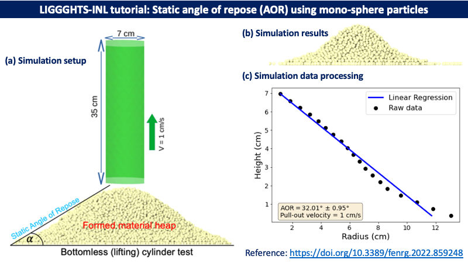
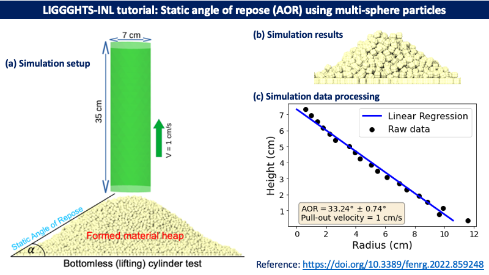

# LIGGGHTS-INL Tutorials

[Tutorial 01a: Static angle of repose (AOR) using mono-sphere particles](/examples/LIGGGHTS/INL_tutorials/t01a_static_angle_of_repose_monosphere)

[Tutorial 01b: Static angle of repose (AOR) using multi-sphere particles](/examples/LIGGGHTS/INL_tutorials/t01b_static_angle_of_repose_multisphere)

