# FIJI User Tutorial

FIJI ([https://imagej.net/Fiji](https://imagej.net/Fiji)) is an image processing package—a "batteries-included" distribution of ImageJ, bundling a lot of plugins which facilitate scientific image analysis.

FIJI can be used to post-process raw X-ray CT images of particles to obtain "cleaned" binary (black/white) stack images. Then the voxel coordinates of the stack images can be exported for constructing the bonded-sphere DEM particle geometry templates as input for LIGGGHTS-INL.

A concise user tutorial is provided.

## Import image sequence

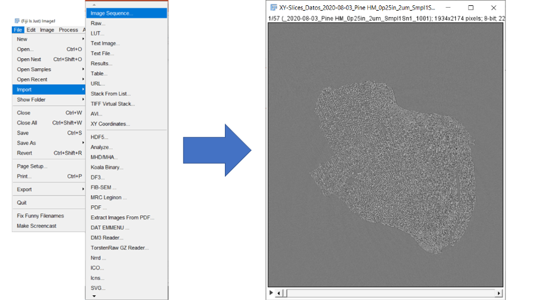

## Crop image sequence (optional)

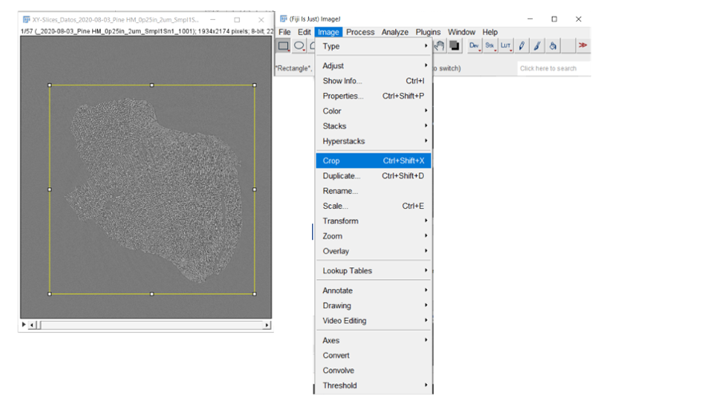

## Decide thrshold

### Auto local threshold

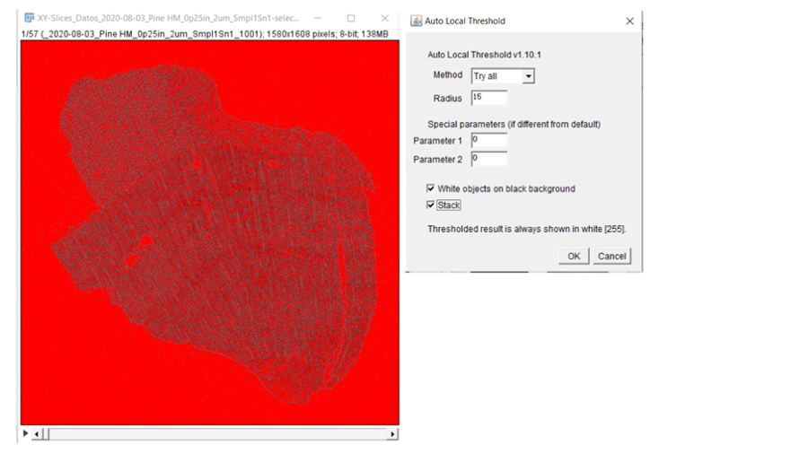

### Manual threshold

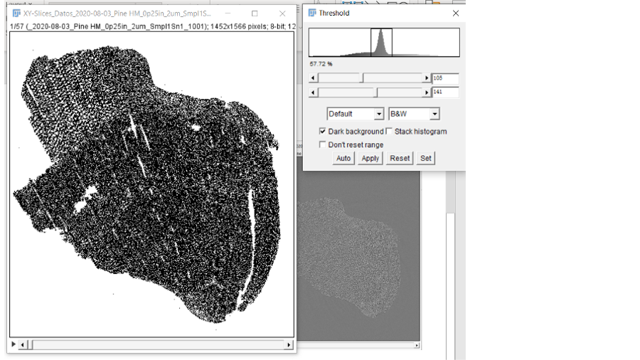

## Binarize images

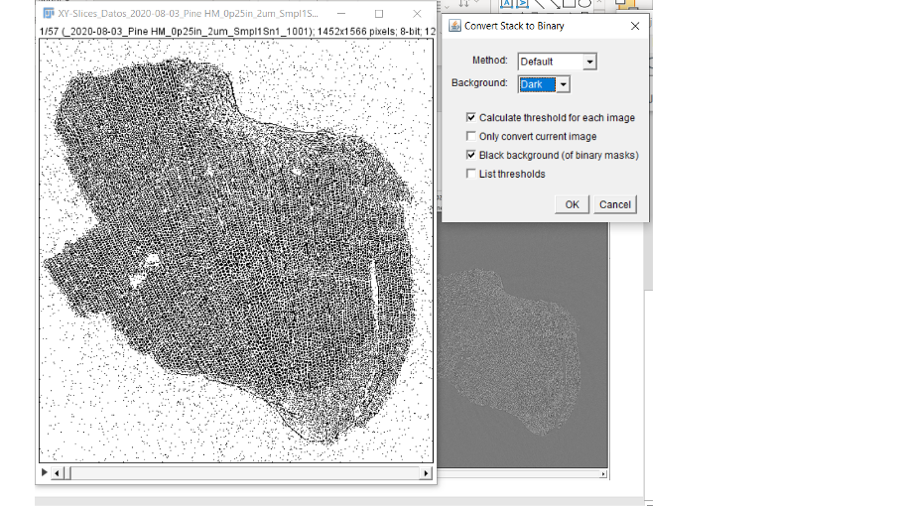

## Denoise (optional)

### Salt and pepper 

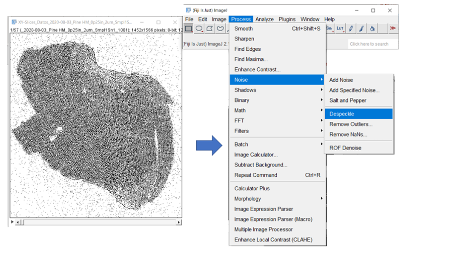

### Manual denoise

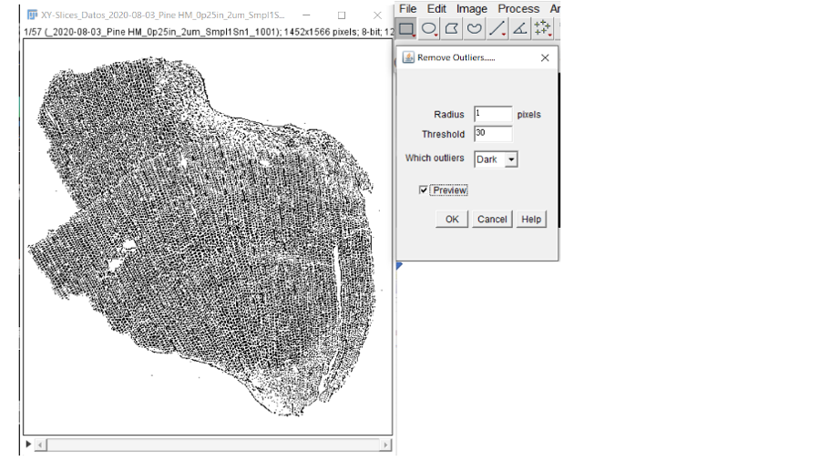

## Subtract background

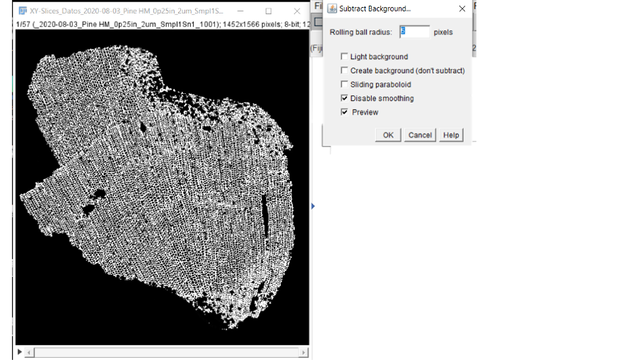

## Check the 3D view (optional)

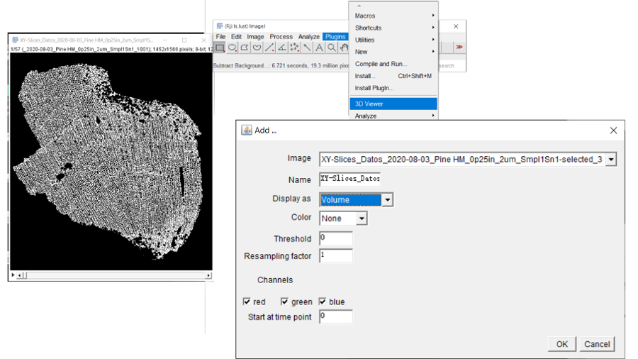

## Save image stack and image sequence

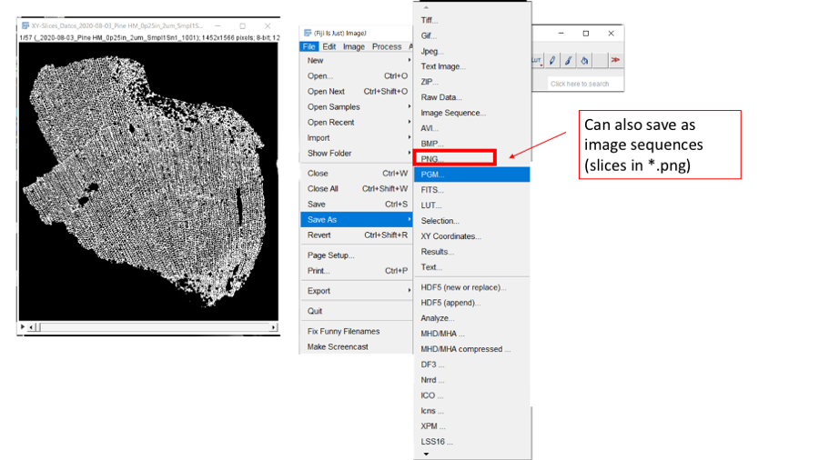

## Export *.obj file and visualize in ParaView

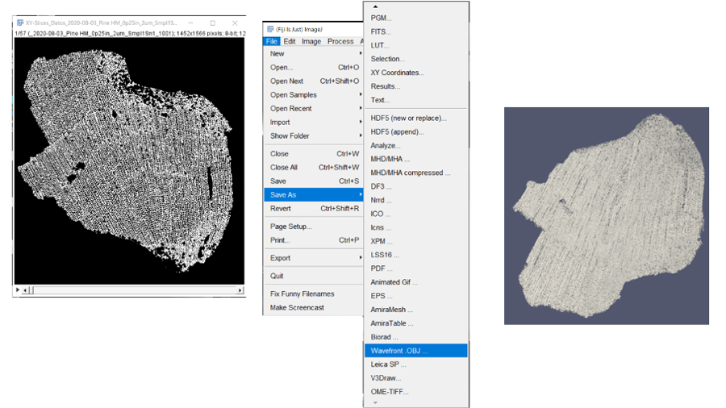

