# 3D Image-Based Porosity Analysis

This instruction describes a set of MATLAB codes that should be used step by step to calculate and visualize the three types of porosity for a Region of Interest (ROI):

- Envelop porosity
- Local porosity
- Directional porosity

Technical point of contact: Yidong Xia ([yidong.xia@inl.gov](yidong.xia@inl.gov))

## Citing our work

If you are using results generated with our MATLAB codes, please cite the following article:

Quan Sun, Yidong Xia, Jordan Klinger, Robert Seifert, Joshua Kane, Vicki Thompson, Qiushi Chen, "X-ray computer tomography-based porosity analysis: Algorithms and application for porous woody biomass." *Powder Technology* 388 (2021): 496-504. [https://doi.org/10.1016/j.powtec.2021.05.006](https://doi.org/10.1016/j.powtec.2021.05.006)
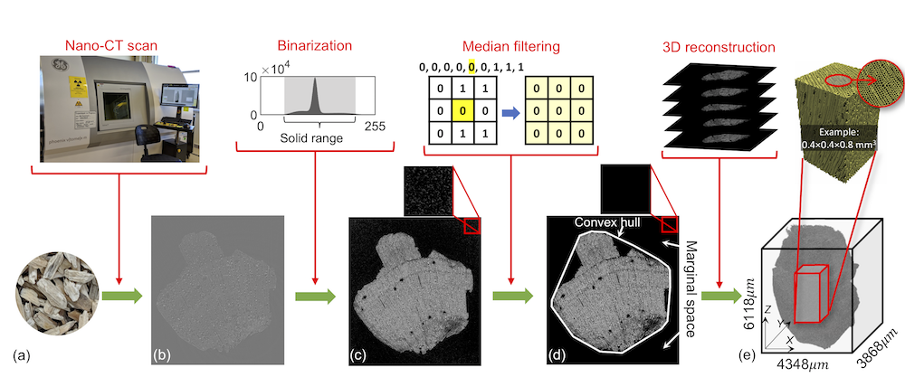

A PDF copy of the authors' manuscript (no journal typesetting) is available on [ResearchGate](https://www.researchgate.net/publication/351366143_X-ray_computed_tomography-based_porosity_analysis_Algorithms_and_application_for_porous_woody_biomass).

## Instructions for the MATLAB codes

**Step 1**: Process 3D CT scan images using FIJI and export binary black/white (BW) slices. Refer to [https://github.com/idaholab/LIGGGHTS-INL/tree/inl/tools/FIJI](https://github.com/idaholab/LIGGGHTS-INL/tree/inl/tools/FIJI) for step-by-step instructions.

**Step 2**: Import BW slices of the ROI and export in MATLAB data format: (a) run `Step2a_import_bw_slices.m` to import the BW slices as a matrix and export in a MAT file; (b) optionally run `Step2b_crop_subchunk.m` to crop a subset of the volumetric matrix.

**Step 3**: Run `Step3_local_porosity.m` to calculate the local porosity.

**Step 4**: Run `Step4_directional_porosity.m` to calculate directional porosity and envelop porosity.

**Step 5**: Run `Step5_plot_local_porosity.m` to plot local porosity.

**Step 6**: Run `Step6_plot_directional_porosity.m` to plot directional porosity.

**Step 7**: Run `Step7_export_voxel_list.m` to export the central coordinates of each voxel.

**Note**: The user only needs to change the kernel size `n = *` and the `type = '**'`

## User tutorials

Two step-by-step user tutorials are provided.

### Example 1: ROI of loose sphere packing

Copy all the MATLAB code files to a new working directory.

**Step2**:

**(a)** Run `Step2a_import_bw_slices.m` to import image slices unzipped from `Example_1/BW_images.zip`.

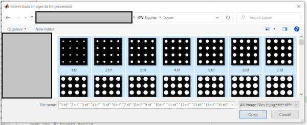

A MAT data file is exported. Reference: `Example_1/Loose_packing.mat`.

**(b)** Crop the binary slices to a 100x100x100 sub-chunk. A MAT data file is exported. Reference: `Example_1/Sub_Loose_packing.mat`.

**Step3**:

Run `Step3_local_porosity.m` to calculate the local porosity using kernel size Le = 5 voxels (set `n = 5`, `type = 'Loose'`).

A MAT data file is exported. Reference: `Example_1/Loose_porosity_5.mat`.

**Step 4**:

Run `Step4_directional_porosity.m` to calculate the directional porosity based on the local porosity results in **step 3** (set `n = 5`, `type = 'Loose'`).

The envelop porosities (both bounding box porosity and convex hull porosity) are also calculated.

A MAT data file is exported. Reference: `Example_1/Loose_5_Dimensional_porosity.mat`.

**Step 5**:

Run `Step5_plot_local_porosity.m` to plot the local porosity (set `n = 5`, `type = 'Loose'`). Reference resultant figures are shown below.

[Local porosity distribution](Example_1/fig_local_porosity.png)

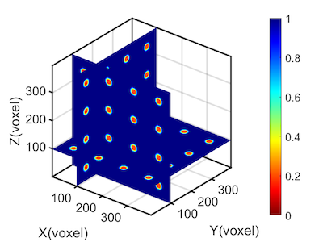

[X slices of local porosity](Example_1/fig_local_porosity_x.png)

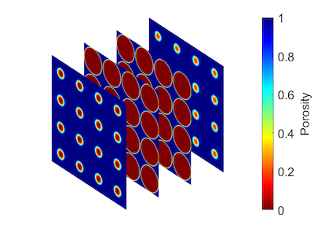

[Y slices of local porosity](Example_1/fig_local_porosity_y.png)

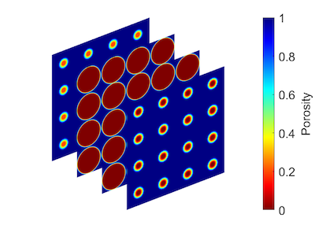

[Z slices of local porosity](Example_1/fig_local_porosity_z.png)

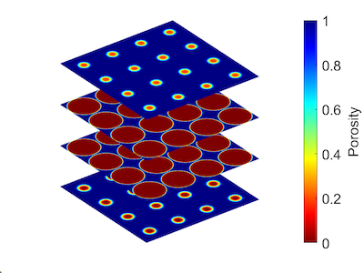

**Step 6**:

Run `Step6_plot_directional_porosity.m` to plot directional porosity (set `n = 5`, `type = 'Loose'`). Reference resultant figures are shown below.

[X directional porosity](Example_1/fig_directional_porosity_x.png)

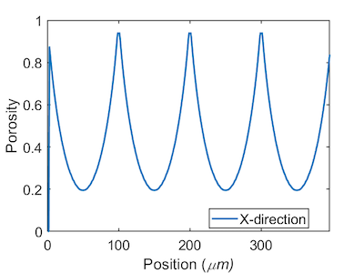

[Y directional porosity](Example_1/fig_directional_porosity_y.png)

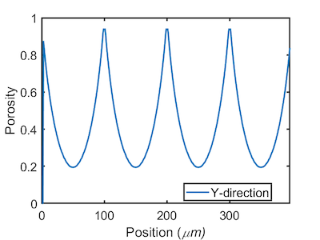

[Z directional porosity](Example_1/fig_directional_porosity_z.png)

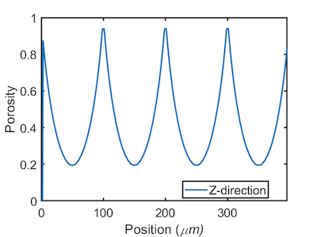

**Step 7**:

Run `Step7_export_voxel_list.m` to export the central coordinates of each voxel of ROI. A "lmp" data file is exported. Reference: `Example_1/vox_list.lmp`.

### Example 2: ROI of stainless steel

Copy all the MATLAB code files to a new working directory.

**Step2**:

**(a)** Run `Step2a_import_bw_slices.m` to import image slices unzipped from `Example_2/BW_images.zip`.

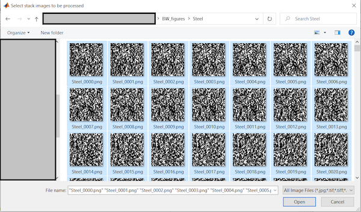

A MAT data file is exported. Reference: `Example_2/Steel_packing.mat`.

**(b)** Crop the binary slices to a 100x100x100 sub-chunk. A MAT data file is exported. Reference: `Example_2/Sub_Steel_packing.mat`.

**Step3**:

Run `Step3_local_porosity.m` to calculate the local porosity using kernel size Le = 5 voxels (set `n = 5`, `type = 'Steel'`).

A MAT data file is exported. Reference: `Example_2/Sub_Steel_porosity_5.mat`.

**Step 4**:

Run `Step4_directional_porosity.m` to calculate the directional porosity based on the local porosity results in **step 3** (set `n = 5`, `type = 'Steel'`).

The envelop porosities (both bounding box porosity and convex hull porosity) are also calculated.

A MAT data file is exported. Reference: `Example_2/Sub_Steel_5_Dimensional_porosity.mat`.

**Step 5**:

Run `Step5_plot_local_porosity.m` to plot the local porosity (set `n = 5`, `type = 'Steel'`). Reference resultant figures are shown below.

[Local porosity distribution](Example_2/fig_local_porosity_distribution.png)

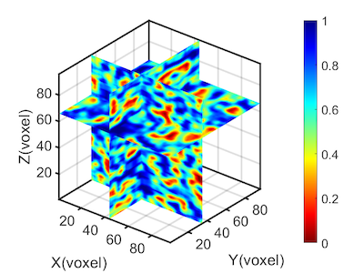

[X slices of local porosity](Example_2/fig_local_porosity_x.png)

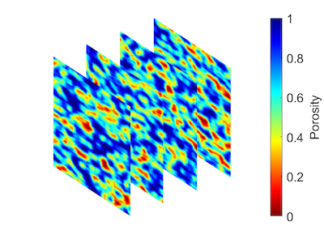

[Y slices of local porosity](Example_2/fig_local_porosity_y.png)

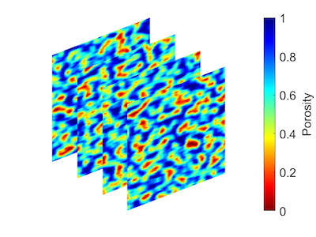

[Z slices of local porosity](Example_2/fig_local_porosity_z.png)

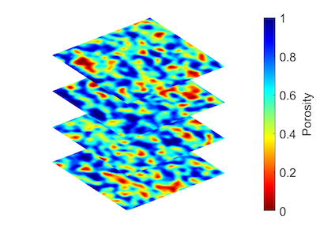

**Step 6**:

Run `Step6_plot_directional_porosity.m` to plot directional porosity (set `n = 5`, `type = 'Steel'`). Reference resultant figures are shown below.

[X directional porosity](Example_2/fig_x_directional_porosity.png)

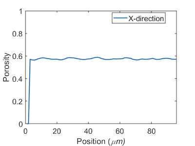

[Y directional porosity](Example_2/fig_y_directional_porosity.png)

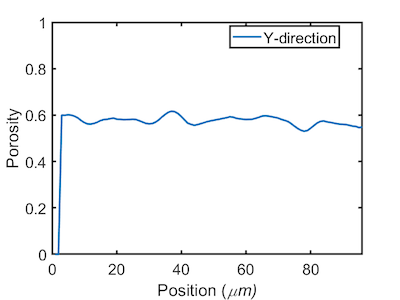

[Z directional porosity](Example_2/fig_z_directional_porosity.png)

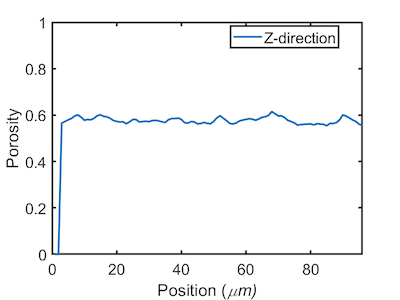

**Step 7**:

Run `Step7_export_voxel_list.m` to export the central coordinates of each voxel of ROI. A "lmp" data file is exported. Reference: `Example_2/vox_list.lmp`.
